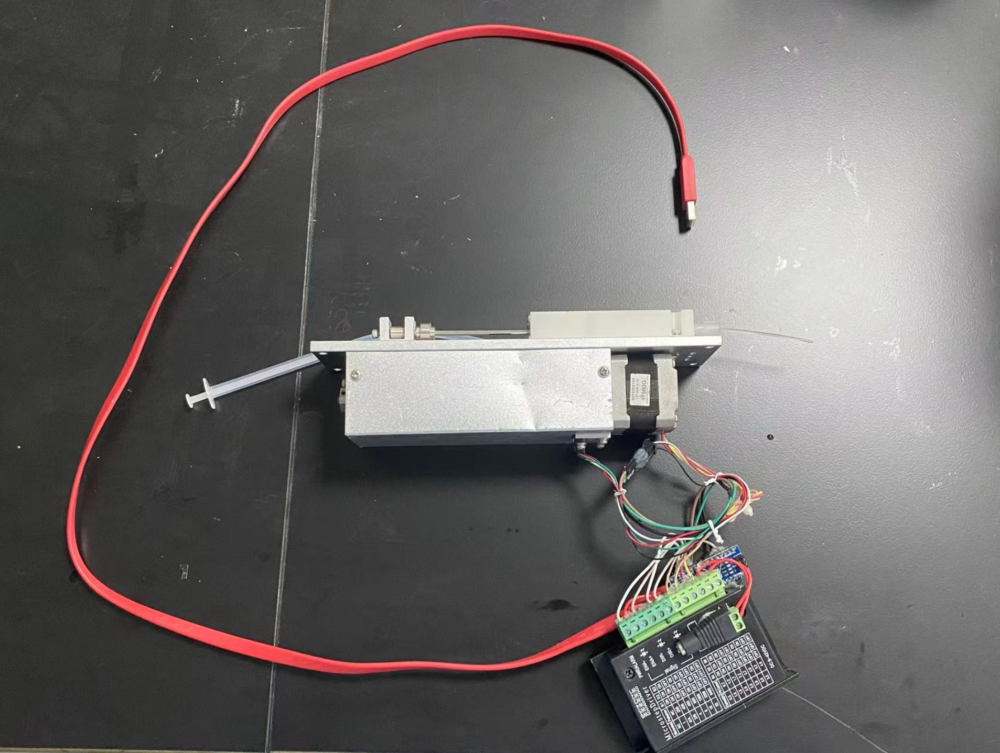

# G-PUMP

G-pump is a microfluidic pump. Now it has four operation mode.

## Inject Mode

Command

```
inject <volume(ul)>
```

## Constant Flow Mode

Command

```
constantFlow <volume> <speed>
```

## PulseFlow Mode

Command

```
pulseFlow <volume> <width> <speed> <interval>
```

where **width** is the volume of individual droplet, **speed** is the velocity of fluids creating the droplet, **interval** is the duration between two droplet.

## Default_Speed Operation

Command

```
default_speed <speed (ul/s)>
```

## Fill

```
fill
```

fill command is to empty the syringe and suck the fluids from the tips, you can also fill the syringe from the bottom.